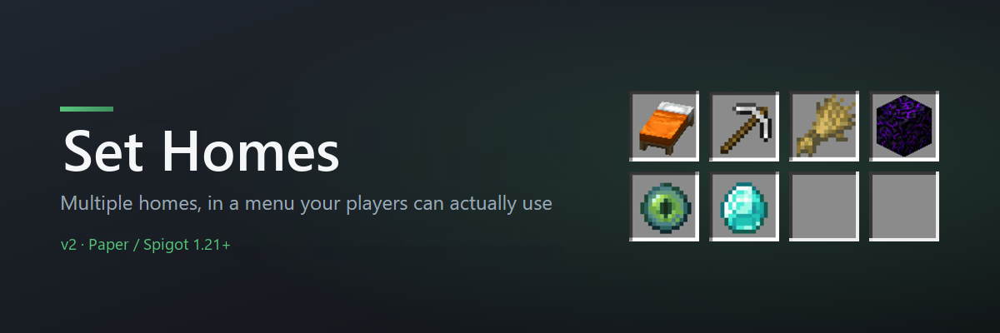
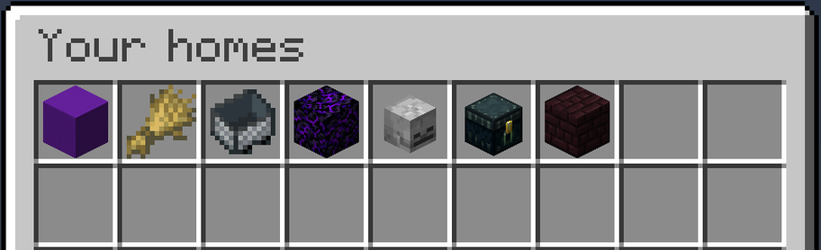
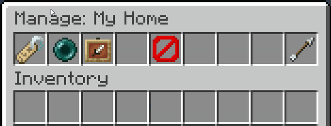
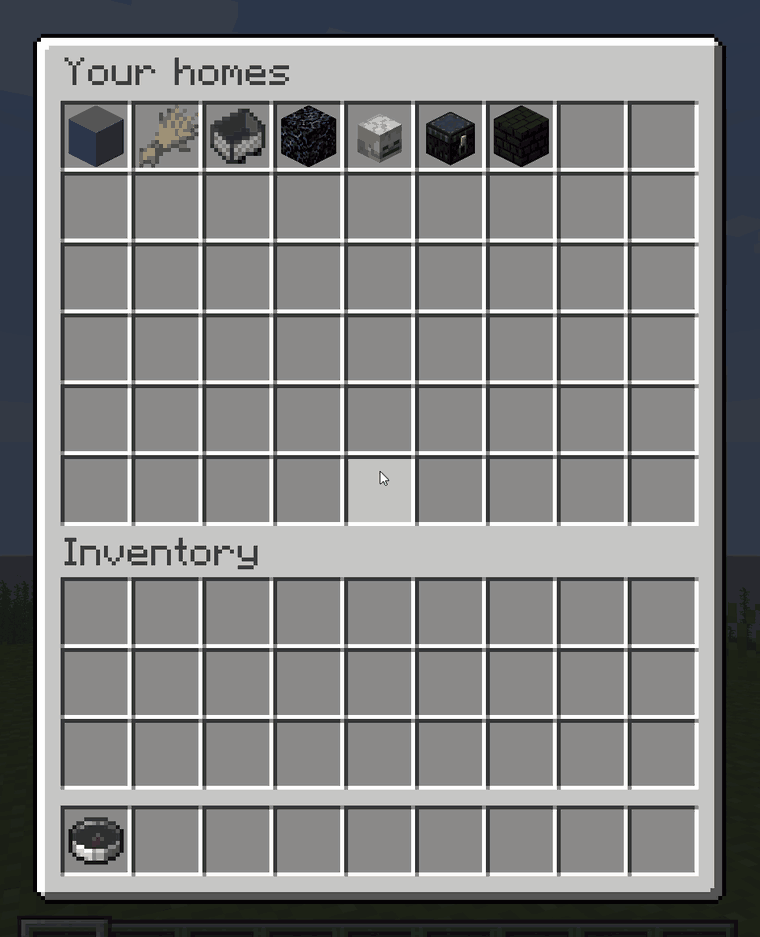
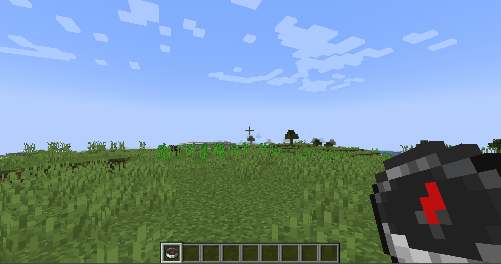
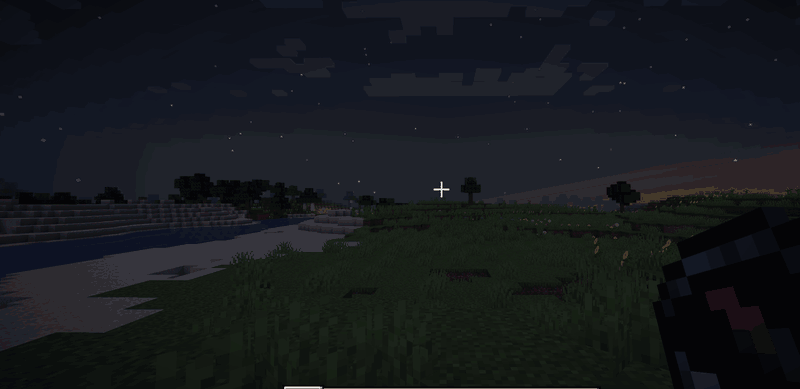
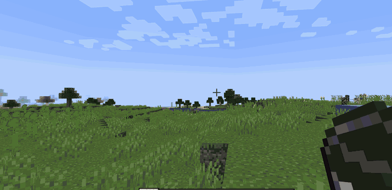

**Set Homes gives every player a menu of their homes.** Left-click one to teleport. Right-click it to rename it, move it, change its icon, or delete it.

[Source](https://github.com/Blockframe-Studios/SetHomesTwo) | [Report a bug](https://github.com/Blockframe-Studios/SetHomesTwo/issues) | [Donate](https://www.paypal.com/donate/?business=8LXCRFX27B37C&no_recurring=0&item_name=Thanks+for+your+support.+It+helps+keep+this+plugin+up+to+date+%3A%29&currency_code=USD)



## Why Set Homes

- **A menu, or a list of commands.** Homes live in a chest-style GUI. Players open it with `/homes` or by right-clicking the configured "Home Item".
- **Every home gets its own icon.** Pick any Minecraft item when you create a home, or change it later to whatever you are holding. A base, a mine and a farm stop looking identical.
- **Rename, move and delete in-game.** Right-click any home to manage it. Deleting always asks first, so nobody loses a base to a misclick.
- **Teleports that do not kill you.** Set Homes checks the destination and relocates you to the nearest safe spot rather than dropping you into blocks, lava, or a fall.
- **Switch without losing anything.** One command imports every home from EssentialsX or Set Homes v1, and shows you exactly what it will do before it does it.
- **Per-rank home limits.** Give donors more homes than default players with LuckPerms groups, or set one server-wide limit.
- **Permissions you can change from the config.** Every `sh2.*` node has a sensible default, and any of them can be moved in `config.yml`. No permissions plugin required.

## Quick start

1. Drop the jar into your `plugins` folder and restart the server.
2. Run `/sethome base` where you are standing.
3. Run `/homes` and click it.

That is genuinely the whole setup. Player permissions default to granted, so your players can create and use homes the moment the plugin loads. See [Permissions](#permissions) if you want to change that.

## Commands

| Command | What it does |
| --- | --- |
| `/sethome [name]` | Creates a home where you stand. |
| `/home [name]` | Teleports you to a home. |
| `/homes` | Opens the homes menu. |
| `/delhome <name>` | Deletes a home. |
| `/uhome <name>` | Moves one of your homes to where you are standing. |

Names are optional on `/sethome` and `/home`. Leave the name off and both use a home called `default`. Home names are unique per player and ignore case, so `base` and `Base` are the same home.

<details>
<summary>Every command, with long forms and admin commands</summary>

| Command | Long form | What it does |
| --- | --- | --- |
| `/sethome [name] [icon] [description]` | `/create-home` | Creates a home where you stand. With no name it is called `default`. |
| `/home [name]` | `/go-home` | Teleports you to a home. With no name it goes to `default`. |
| `/homes` | - | Opens the homes menu. |
| `/delhome <name>` | `/delete-home` | Deletes a home. |
| `/uhome <name>` | `/move-home` | Moves one of your homes to where you are standing. |
| `/list-homes` | - | Lists your homes in chat. Click a name to teleport. |
| `/give-homes-item` | - | Gives you the item that opens the menu. |

On `/sethome`, a second word that names a real item becomes the icon, and everything after it is the description. So `/sethome base stone house` creates `base` with a stone icon and the description "house". If you wanted the whole phrase as the description, put `d` in the icon position: `/sethome base d stone house`. The reply names the icon it chose, so there is never any guessing.

**Admin commands**

| Command | What it does |
| --- | --- |
| `/set-max-homes [group] <number>` (alias `/setmax`) | Sets the home limit, per LuckPerms group or server-wide. |
| `/get-player-homes <player>` | Lists another player's homes. |
| `/home-of <player> <home>` (long form `/go-player-home`) | Teleports you to another player's home. |
| `/delhome-of <player> <home>` (long form `/delete-player-home`) | Deletes another player's home. |
| `/uhome-of <player> <home>` (long form `/move-player-home`) | Moves another player's home to where you are standing. |
| `/blacklist add <world...>` (alias `/add-to-blacklist`) | Stops homes being set in a world. |
| `/blacklist remove <world...>` (alias `/remove-from-blacklist`) | Lifts the restriction again. |
| `/blacklist list` (alias `/get-blacklisted-dimensions`) | Shows which worlds are blacklisted. |
| `/import-homes <sethomes\|essentialsx> [confirm]` | Imports homes from another plugin. Dry-run unless `confirm` is given. |

The three blacklist commands are one command with three aliases. Nothing you already type changes: `/add-to-blacklist world_nether` still adds that world, and `/get-blacklisted-dimensions` still lists them. Give worlds by the name the server knows them by, in lower case, which on a default setup means `world`, `world_nether` and `world_the_end`.

The three commands that take a player accept anyone who has saved homes, whether or not they are online. Tab completion only offers online players, because there is no lookup for every stored name.

</details>

## Managing homes



Open your homes with `/homes`, or right-click the homes item. Then:

| Action | What happens |
| --- | --- |
| Left-click a home | Teleports you there |
| Right-click a home | Opens the management menu below |
| Rename | Opens an anvil prompt for the new name |
| Move home here | Repoints the home at where you are standing |
| Set icon to held item | The home's icon becomes whatever you are holding |
| Delete | Asks for confirmation first |



The management menu is controlled by `sh2.manage-homes`, which defaults to granted.

Changing a home's icon works the same way. Hold the item you want and click **Set icon to held item**:



## Teleporting



By default players wait three seconds before a teleport fires, and moving cancels it, so a home is not a free escape from a fight. Set `delay: 0` for instant teleports, or `cancelOnMove: false` to let players walk during the countdown.



Before it drops anyone anywhere, Set Homes checks the destination is safe to stand in. If a home has been built over, flooded with lava, or left hanging above a drop, the player is moved to the nearest safe spot instead, or the teleport is cancelled and they are told why. Turn it off with `teleportSafety: false`.

## Permissions

Nothing here needs a permissions plugin. Out of the box, every player can create, list, teleport to and manage their own homes, and operators get everything else.

Two bundles group the nodes, so you can move a whole role in one line:

| Bundle | Default | Contains |
| --- | --- | --- |
| `sh2.player` | everyone | `sh2.create-home`, `sh2.go-home`, `sh2.list-homes`, `sh2.delete-home`, `sh2.teleport`, `sh2.give-homes-item`, `sh2.manage-homes`, `sh2.move-home` |
| `sh2.admin` | OP | `sh2.player`, plus every admin and bypass node |

<details>
<summary>Full permission list</summary>

| Permission | Default | Allows |
| --- | --- | --- |
| `sh2.create-home` | everyone | Creating homes |
| `sh2.go-home` | everyone | Using the go-home command |
| `sh2.teleport` | everyone | Actually teleporting to a home |
| `sh2.list-homes` | everyone | Listing homes in chat, and `/homes` |
| `sh2.delete-home` | everyone | Deleting your own homes |
| `sh2.give-homes-item` | everyone | Getting the menu item |
| `sh2.manage-homes` | everyone | Renaming, moving, re-iconing and deleting from the GUI |
| `sh2.move-home` | everyone | Moving your own home with `/uhome` |
| `sh2.set-max-homes` | OP | Setting home limits |
| `sh2.get-player-homes` | OP | Viewing another player's homes |
| `sh2.go-player-home` | OP | Teleporting to another player's home |
| `sh2.delete-player-home` | OP | Deleting another player's home |
| `sh2.move-player-home` | OP | Moving another player's home |
| `sh2.add-to-blacklist` | OP | Blacklisting a world |
| `sh2.remove-from-blacklist` | OP | Un-blacklisting a world |
| `sh2.get-blacklisted-dimensions` | OP | Listing blacklisted worlds |
| `sh2.import-homes` | OP | Importing from another plugin |
| `sh2.update-notify` | OP | Being told on join that a newer release exists |
| `sh2.bypass-max-homes` | OP | Creating homes past the configured maximum, whether the limit is server-wide or per group |
| `sh2.bypass-blacklist` | OP | Creating a home in a blacklisted world, moving a home into one, and teleporting to a home already in one |
| `sh2.bypass-teleport-delay` | OP | Teleporting with no countdown, and not being cancelled by moving |

These nodes are granted by the bundles, which is why denying a bundle takes its whole set away at once. Granting or denying an individual node works exactly as the table describes.

Note that `sh2.move-home` sits in `sh2.player`, not behind `sh2.manage-homes`. If you took `sh2.manage-homes` away to stop players relocating their homes, deny `sh2.move-home` as well or `/uhome` gives the ability back.

</details>

### Changing permissions

Uncomment the `permissions:` block in `config.yml` and list the nodes you want to move:

```yaml
permissions:
  sh2.manage-homes: false
  sh2.get-player-homes: true
  sh2.import-homes: op
```

Accepted values are `true` (everyone), `false` (nobody), `op` (operators only) and `not-op` (everyone except operators). A deny applies to operators too, so use `op` if you want a node gone for everyone except them.

You can name a bundle here as well as a single node, so `sh2.player: false` moves all eight player nodes in one line. There is no wildcard, so list whatever you want changed. If a line does not seem to take effect, check the server log at startup: anything the plugin could not read is named there.

**This only changes a default.** If you run LuckPerms or similar, an explicit grant or deny there still wins. The config block decides what happens to a player the permissions plugin says nothing about.

Take care with `sh2.import-homes`. Anyone who can run `/import-homes <source> confirm` can write homes for every player on the server, so granting it to everyone is a real risk.

<details>
<summary>Other ways to set permissions</summary>

**With LuckPerms**, the equivalent one-liner is:

```
/lp group default permission set sh2.player true
```

**Without touching `config.yml` at all**, the server's own `permissions.yml` can wrap the nodes in a rank of your own:

```yaml
myserver.moderator:
  default: false
  children:
    sh2.player: true
    sh2.get-player-homes: true
    sh2.go-player-home: true
```

Then grant `myserver.moderator` to whoever should have it.

</details>

## Configuration

Settings live in **`plugins/SetHomesTwo/config.yml`** on your server, written the first time the plugin starts. Edit it in any text editor, save, then **restart the server**. There is no in-game reload command, so changes do not apply until the server comes back up.

The file is commented throughout, and every message the plugin sends can be rewritten in it. These are the settings most servers actually change:

| Setting | Default | What it does |
| --- | --- | --- |
| `delay` | `3` | Seconds you must stand still before teleporting. `0` is instant. |
| `cancelOnMove` | `true` | Cancel the teleport if the player moves during the countdown. |
| `teleportSafety` | `true` | Relocate to the nearest safe spot instead of teleporting into danger. |
| `maxHomeEnabled` | `false` | Turn home limits on. |
| `maxHomesType` | `groups` | `singular` for one server-wide limit, `groups` for per-rank limits. |
| `openHomeItem` | `compass` | The item players right-click to open the menu. |
| `defaultHomeItem` | `white_wool` | Icon a home gets when the player names none. |
| `inventoryTitle` | `Your homes` | Title of the homes menu. |
| `maxHomeNameLength` | `32` | Longest home name allowed. |
| `permissions` | commented out | Changes the default of any `sh2.*` node. See [Changing permissions](#changing-permissions). |

Per-rank limits need [LuckPerms](https://luckperms.net/download) and `maxHomesType: groups`.

That table is only the common settings. For the complete list, see [`default-config.yml`](https://github.com/Blockframe-Studios/SetHomesTwo/blob/master/src/main/resources/default-config.yml), the file your `config.yml` is first written from. Every setting the plugin has is in there, commented in place.

<details>
<summary><strong>Upgrading? Your existing config.yml will not gain the new settings</strong></summary>

Set Homes never touches a `config.yml` that already exists, so settings added in a later release do not appear in a file written by an earlier one. Any missing setting quietly falls back to its default, so nothing breaks, but you cannot change a setting you cannot see.

To pick one up, copy the key you want out of [`default-config.yml`](https://github.com/Blockframe-Studios/SetHomesTwo/blob/master/src/main/resources/default-config.yml) into your file and restart. To start clean, rename your `config.yml` and restart. A fresh one is written with everything in it, and you can copy your old values across.

</details>

## Coming from EssentialsX or Set Homes v1

Your players keep their homes. The old plugin does not even need to be running, because the importer reads its data files directly.

**Coming from Set Homes v1, move the old jar out of `plugins/` first and keep it.** Both plugins provide `/sethome`, `/home` and `/delhome`, and v1 wins those names whatever the load order, so homes created after the upgrade would go into v1's files while the menu read ours. Rather than let that happen quietly, Set Homes refuses to start while a Set Homes v1 jar is installed, and prints what to do in the console. Your server keeps running v1 exactly as before until you move the jar. Leave the `plugins/SetHomes/` folder itself alone; the importer reads it and never writes to it.

1. Run `/import-homes essentialsx` (or `/import-homes sethomes`). This is a **preview only**. It reports how many homes it would import and warns about any it would skip, and changes nothing.
2. Happy with the numbers? Run it again with `confirm` on the end.
3. Move the old jar out of `plugins/`. Keep it somewhere safe rather than deleting it, so you can go back if you want to.

Existing homes are never overwritten, so re-running the import is always safe. Homes in worlds that no longer exist are skipped with a warning naming the world.

Set Homes v1 told `base` and `Base` apart, while home names here ignore case. A player holding both keeps both: the second one is imported under the next free name, so `Base` arrives as `Base2`, and the report and the server log name it. No home is dropped for a name clash.

<details>
<summary>What else the Set Homes v1 import brings across</summary>

- **The v1 world blacklist**, added to your Set Homes v2 blacklist alongside the homes. Re-running never adds a world twice.
- **A report of your v1 `config.yml`**, listing any setting that has an equivalent here and the key to put it under. Nothing is written to `config.yml` automatically. The table further down has the same mapping for pasting in by hand.
- **Player names**, read from the server's own player list. That means `/get-player-homes`, `/home-of`, `/delhome-of` and `/uhome-of` work on an imported player straight away, for anyone this server has seen before. A player the server has never seen imports with no name and is picked up automatically on their first join.

</details>

<details>
<summary>Set Homes v1: what each command and permission became</summary>

| Set Homes v1 | Set Homes v2 |
| --- | --- |
| `/sethome [name] [description]` | `/sethome [name] [icon] [description]` |
| `/home [name]` | `/home [name]` |
| `/homes [player]` | `/list-homes` for your own list, `/get-player-homes <player>` for someone else's. `/homes` now opens the menu instead. |
| `/delhome [name]` | `/delhome <name>` |
| `/uhome <name> [description]` | `/uhome <name>` |
| `/home-of <player> [home]` | `/home-of <player> <home>` |
| `/delhome-of <player> [home]` | `/delhome-of <player> <home>` |
| `/uhome-of <player> [home]` | `/uhome-of <player> <home>` |
| `/blacklist <add\|remove> <world>` | `/blacklist <add\|remove\|list> <world...>` |
| `/setmax <group> <number>` | `/setmax`, or the long form `/set-max-homes` |

| v1 permission | v2 permission |
| --- | --- |
| `homes.home` | `sh2.go-home`, plus `sh2.teleport` to actually arrive |
| `homes.sethome` | `sh2.create-home` |
| `homes.delhome` | `sh2.delete-home` |
| `homes.gethomes` | `sh2.get-player-homes` |
| `homes.home-of` | `sh2.go-player-home` |
| `homes.delhome-of` | `sh2.delete-player-home` |
| `homes.uhome` | `sh2.move-home` |
| `homes.uhome-of` | `sh2.move-player-home` |
| `homes.blacklist_add` | `sh2.add-to-blacklist` |
| `homes.blacklist_remove` | `sh2.remove-from-blacklist` |
| `homes.blacklist_list` | `sh2.get-blacklisted-dimensions` |
| `homes.setmax` | `sh2.set-max-homes` |
| `homes.config_bypass` | `sh2.bypass-max-homes`, `sh2.bypass-blacklist` and `sh2.bypass-teleport-delay` |
| `homes.strike` | Nothing |
| `homes.*` | `sh2.admin` |

Worth knowing before you copy a permissions file across:

- **`homes.config_bypass` is three nodes now.** In v1 it let a player exceed the home limit, set homes in blacklisted worlds, and skip the teleport delay and cooldown, all at once. Grant all three `sh2.bypass-*` nodes to reproduce that. Nothing is lost on the cooldown, because v2 has no cooldown feature.
- **Your v1 unnamed home is called `default`.** The importer files it under that name, and a bare `/sethome` or `/home` uses the same name, so both keep working exactly as they did. `/home-of steve default` reaches an imported unnamed home.
- **`/sethome` takes a description straight after the name again**, as it did in v1. v2 adds an optional icon in between, so a second word naming a real item is read as the icon. `/sethome base d my main base` forces the default icon and keeps the whole phrase.
- **The one-letter aliases are not provided.** v1 registered `/h`, `/sh`, `/dh`, `/lh`, `/ho`, `/dho`, `/uh`, `/uho`, `/bl` and `/sm`. If your players are used to them, map them yourself in the server's own `commands.yml`.
- **`/homes` means something different.** In v1 it printed a chat list. In v2 it opens the homes menu, and `/list-homes` prints the chat list.

</details>

<details>
<summary>Set Homes v1: config.yml settings and their v2 equivalent</summary>

| v1 `config.yml` | v2 `config.yml` | Note |
| --- | --- | --- |
| `tp-delay` | `delay` | direct |
| `tp-cancelOnMove` | `cancelOnMove` | direct |
| `max-homes.<group>` | `maxHomes.<group>` | also set `maxHomesType: groups` and `maxHomeEnabled: true`. A v1 value of `0` means unlimited; leave that group out of `maxHomes` in v2 rather than setting it to `0`, which would cap it at zero homes instead. |
| `max-homes-msg` | `maxHomesReached` | direct. v1's `§` colour codes paste in unchanged |
| `tp-cancelOnMove-msg` | `movedWhileTeleporting` | direct. v1's `§` colour codes paste in unchanged |
| `tp-cooldown` | none | v2 has no cooldown feature |
| `tp-cooldown-msg` | none | follows the above |

</details>

## FAQ

<details>
<summary>How do my players teleport home?</summary>

Three ways, all equivalent: `/home <name>`, opening `/homes` and left-clicking, or right-clicking the assigned "Home Item" from `/give-homes-item`.

</details>

<details>
<summary>Only OPs can create homes. How do I let everyone in?</summary>

Update to 1.1.0 or later. On older versions every permission defaulted to OP; they now default to granted for players. If you use a permissions plugin that denies unlisted nodes, grant `sh2.player`, which covers every ordinary player node in one go.

</details>

<details>
<summary>How do I turn a permission off without installing a permissions plugin?</summary>

See [Changing permissions](#changing-permissions).

</details>

<details>
<summary>A player says one of their homes shows "Cannot teleport here: dimension blacklisted". Why?</summary>

The world that home is in has been blacklisted, so the home is listed but not reachable. Check `/blacklist list`. Either take the world off the list with `/blacklist remove <world>`, or move the home somewhere else with `/uhome-of <player> <home>` while standing where it should go.

</details>

<details>
<summary>How do I give donors more homes than everyone else?</summary>

Install LuckPerms, set `maxHomeEnabled: true` and `maxHomesType: groups`, then run `/set-max-homes <group> <number>` for each rank.

</details>

<details>
<summary>Can I run it alongside EssentialsX?</summary>

Not comfortably. Both register `/sethome`, `/home` and `/delhome`, and whichever loads last wins. Import your homes, then remove EssentialsX.

</details>

<details>
<summary>Where are homes stored?</summary>

In a SQLite database in `plugins/SetHomesTwo/`. Nothing external to install and nothing to configure.

</details>

## Requirements

- Paper or Spigot **1.21+**
- **Java 21**, which Minecraft 1.21 servers already require
- Optional: [LuckPerms](https://luckperms.net/download), only for per-rank home limits

## Support

Found a bug or want a feature? Open an issue on [GitHub](https://github.com/Blockframe-Studios/SetHomesTwo/issues). It gets seen faster than a comment on this page.

[Source](https://github.com/Blockframe-Studios/SetHomesTwo) | [Report a bug](https://github.com/Blockframe-Studios/SetHomesTwo/issues) | [Donate](https://www.paypal.com/donate/?business=8LXCRFX27B37C&no_recurring=0&item_name=Thanks+for+your+support.+It+helps+keep+this+plugin+up+to+date+%3A%29&currency_code=USD)

## Changelog

#### 1.2.2 (2026-08-15)

- Fixed the update notice repeating on every join. An available release is now announced once and then held back for `updateReminderDays` (7 by default) before it is mentioned again; a newer release is still announced straight away. Set `updateReminderDays: 0` to announce each release exactly once.

#### 1.2.1 (2026-08-14)

- Added an update notice: the console at startup, and admins holding `sh2.update-notify` as they join, are told when a newer release is on GitHub. Set `checkForUpdates: false` to stop the plugin making the request at all.

#### 1.2.0 (2026-08-12)

Behaviour changes to be aware of before updating:
- Home names are now unique per player without regard to case, so you can no longer create both `base` and `Base`. Homes you already have are untouched, including any existing duplicates.
- `/delete-home` now deletes a single home. Previously it deleted every home whose name matched, so a player with duplicate names lost all of them at once.
- The plugin now requires Java 21 to run (previously Java 9). Minecraft 1.21 servers already require Java 21, so most setups need no change.

- Added a home management menu: right-click a home in the homes GUI to rename it, move it to where you are standing, set its icon to the item you are holding, or delete it. Deleting asks for confirmation first, and renaming opens an anvil prompt for the new name.
- Added a "Right click to edit home" hint to homes in the list, shown only to players who are able to manage them.
- Added the `sh2.manage-homes` permission, which controls the management menu and defaults to granted.
- Added config keys for the management menu: `manageHomeTitle`, `renamePromptTitle`, `manageHomeHint`, `maxHomeNameLength`, the button item and name pairs, and the new success and error messages. See `default-config.yml`.
- Fixed home updates and deletes not being scoped to the owning player.
- Fixed the homes list hiding a home behind the previous-page button once a player had 46 or more homes, and showing an empty second page to a player with exactly 45 homes.

#### 1.1.0 (2026-08-11)
- Added `/sethome`, `/delhome`, and `/home` as classic aliases for `/create-home`, `/delete-home`, and `/go-home`.
- Player permissions (create-home, go-home, list-homes, delete-home, teleport, give-homes-item) now default to granted for all players; admin permissions still default to OP.
- Added the `/homes` command, which opens the homes GUI directly; `/list-homes` still prints the chat listing.
- Added `/import-homes` to import homes from Set Homes v1 or EssentialsX (dry-run by default, pass `confirm` to apply).
- Added a teleport safety check that relocates players to the nearest safe spot, or cancels the teleport, when a home would put them in blocks, lava, or a dangerous fall.
- Teleport destination chunks are now loaded during the countdown, so arriving at a distant home is smoother.
- Fixed stale teleport attempts surviving a server restart, which could block a player's next teleport (finishes #14).
- Fixed error when maxHomesType is groups and LuckPerms is not installed. The limit is now skipped with a console warning instead.

#### Earlier releases
- Added go-home and list-homes commands.
- Fixed issue where players missing sh2.teleport could not break blocks.
- Fixed issue where a player who has an open homes gui has their inventory overwritten by the next person to open a homes gui.
